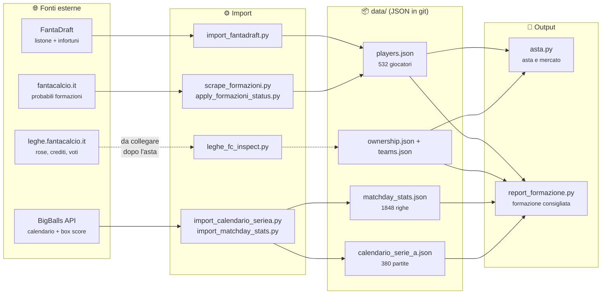

<h1 align="center">🍝 Fanta Carbonara</h1>

<p align="center">
  <em>Assistente dati per una lega di fantacalcio Classic: rose, mercato, storico Serie A e consigli di formazione.<br>
  Costruito per essere pilotato a voce insieme a Claude Code.</em>
</p>

<p align="center">
  
  
  
  
</p>

---

## Cos'è (e cosa non è)

Una lega da 12 squadre su [leghe.fantacalcio.it](https://leghe.fantacalcio.it), modalità
Classic, 500 crediti, rose 3P-8D-8C-6A. Questo repo tiene **i dati** di quella lega e
li usa per rispondere a due domande: *chi schiero questa giornata* e *quanto vale
questo scambio*.

**Non** fa l'asta al posto tuo. L'asta si fa a voce, tra amici, come si è sempre fatta:
il repo la trascrive man mano (crediti, rose, slot per ruolo) e non suggerisce su chi
rilanciare.

La regola che tiene in piedi tutto il progetto è una sola:

> **Un dato che manca resta mancante.** Mai un voto stimato, mai uno status dedotto,
> mai una giornata indovinata. Se una fonte non ce l'ha, lo script lo dice e si ferma.

Sembra pedante finché non scopri che la tua fonte di statistiche mette un giocatore
del Liverpool nel tabellino di Roma-Inter (→ [`.docs/bigballs-api.md`](.docs/bigballs-api.md)).

## Come si muovono i dati



## Quickstart

```bash
pip install -r requirements.txt

# 1. Listone completo della Serie A (pre-asta)
python3 scripts/import_fantadraft.py

# 2. Calendario e risultati Serie A
export BIGBALLS_API_KEY=...
python3 scripts/import_calendario_seriea.py --season 2026 --status finished
python3 scripts/import_calendario_seriea.py --season 2026 --status scheduled

# 3. Storico per giocatore (gol, assist, cartellini, falli, minuti)
python3 scripts/import_matchday_stats.py
```

Nessuna credenziale è obbligatoria per il modulo asta: legge e scrive solo file JSON
in `data/`.

## In azione

**Chi è ancora libero tra gli attaccanti**, durante l'asta a chiamata:

```console
$ python3 scripts/asta.py disponibili --ruolo A --top 8
  [A] Malen                     Roma            Qt.A: 37
  [A] Martinez L.               Inter           Qt.A: 35
  [A] Hojlund                   Napoli          Qt.A: 29
  [A] Thuram                    Inter           Qt.A: 28
  [A] Ramos G.                  Milan           Qt.A: 27
  [A] Kean                      Como            Qt.A: 25
  [A] Kolo Muani                Juventus        Qt.A: 24
  [A] Woltemade                 Juventus        Qt.A: 23
```

**Registrare quello che succede** — acquisti, scambi misti, svincoli:

```bash
python3 scripts/asta.py assegna  --player-id fd2764 --team-id t03 --prezzo 112
python3 scripts/asta.py stato    --team-id t03
python3 scripts/asta.py scambio  --team-a t03 --team-b t07 \
    --players-a fd2764 --players-b fd5841 --credits-b-a 15
python3 scripts/asta.py svincolo --player-id fd5725 --team-id t03 --rimborso 1
```

**Cosa abilita lo storico** — esempio ricavato dai dati già nel repo (giornate 1-5,
396 giocatori con almeno una presenza):

```
TOP GOL                                        TOP CARTELLINI GIALLI
Malen        Roma       6 gol in 347'          Ostigard   Genoa      3 gialli, 6 falli
Raimondo     Frosinone  4 gol in 329'          Akanji     Inter      2 gialli, 4 falli
Varela G.    Monza      4 gol in 341'          Hermoso    Roma       2 gialli, 3 falli
```

Non è una classifica da esibire: i cartellini e i falli dicono chi rischia nelle partite
toste. Per le squalifiche vere il repo non conta i gialli da sé, legge la fonte
ufficiale: squalificati e diffidati arrivano dalla pagina "Indisponibili" di
fantacalcio.it, e il report esclude i primi e ti avvisa dei secondi.

## Struttura dei dati

Tutto in `data/`, JSON versionati in git — niente database, niente stato nascosto.

| File | Contenuto | Stato |
|---|---|---|
| `players.json` | Pool completo Serie A: ruolo, squadra, quotazione, status | 532 giocatori |
| `calendario_serie_a.json` | Calendario e risultati per giornata | 380 partite (50 giocate) |
| `matchday_stats.json` | Per giocatore/partita: gol, assist, cartellini, falli, minuti, avversario, casa/trasferta | 1848 righe |
| `injuries.json` | Infortuni in corso con rientro previsto | 48 voci |
| `squalifiche.json` | Squalificati e diffidati attuali | aggiornato ogni giro |
| `teams.json` | Le 12 squadre della lega, crediti totali e rimanenti | da popolare |
| `ownership.json` | Chi possiede chi, a che prezzo, con che modalità | dopo l'asta |
| `market_log.json` | Log di acquisti, scambi e svincoli | dopo l'asta |
| `formazioni_history.json` | Storico delle probabili formazioni pubblicate | accumulo continuo |

`config/league.json` tiene moduli ammessi, requisiti di rosa, `my_team_id` e le regole
della lega prese dal regolamento FantaCarbonara, ognuna con la sua fonte:

- **`regole_lega`**: niente modificatore di difesa, cambi illimitati nello stesso ruolo,
  rinvii (vedi sotto), scadenza della formazione, penalità per formazione non schierata.
- **`regole_mercato`**: ogni offerta deve lasciare almeno 1 credito per ogni slot ancora
  vuoto, pena la perdita del giocatore e di tutti i successivi; svincolo rimborsato 1
  credito, cessione all'estero o in Serie B rimborsata al prezzo d'acquisto; asta di
  riparazione con +50 crediti; scambi solo a gennaio. `asta.py` non le applica ancora.
- **`competizioni`**: criteri di parità di campionato, Champions, Europa e Coppa Italia,
  per la futura classifica.
- **`scoring`**: solo a titolo informativo, il fantavoto arriva già calcolato dal sito.
  Due valori restano `null` perché il regolamento non li chiarisce ("Rigore +2", porta
  inviolata).

## Come ragiona il consiglio di formazione

`report_formazione.py` ordina i giocatori di ogni ruolo per media quando giocano, perché
con i cambi illimitati chi non scende in campo viene coperto dal primo della panchina.
La probabilità di giocare non entra nell'ordine, ma negli avvisi ("se non gioca entra X").

Le partite rinviate seguono la regola della lega, che vale **per giornata**:

| Partite rinviate nella giornata | Cosa prendono i giocatori | Come li tratta il report |
|---|---|---|
| da 1 a 3 | 6 politico, senza recupero | valgono 6 nell'ordine (6 sicuro, niente cambio) |
| più di 3 | il voto del recupero, per tutte | restano con la loro media |

Una partita spostata ma giocata dentro la giornata non è un rinvio. Con esattamente 3
rinvii il report avvisa che uno in più, anche dopo la scadenza, cambia la regola per
tutti. Stampa anche la **scadenza della formazione**: l'inizio della prima partita non
rinviata del turno. Se il turno non si ricostruisce dalle date del calendario, non
applica niente di tutto questo e chiede di controllare a mano. Revisione completa della
logica: [`.docs/difetti-consiglio-formazione.md`](.docs/difetti-consiglio-formazione.md).

## Fonti dei dati, con i loro difetti

Nessuna fonte è trattata come oro colato. Quello che sappiamo è documentato, non scoperto
due volte:

| Fonte | Cosa ci prendiamo | Cosa sappiamo che non funziona |
|---|---|---|
| **FantaDraft** (GitHub, pubblico) | Listone completo + infortuni | Può essere indietro sui trasferimenti recenti |
| **fantacalcio.it** (HTML pubblico) | Probabili formazioni → status giocatore; squalificati e diffidati | Matching per nome, non per id: i "non trovati" vanno guardati. La lista piena degli squalificati non si era ancora vista quando è stato scritto lo scraper |
| **BigBalls API** | Calendario, risultati, box score per giocatore | Tabellini contaminati da squadre estranee, eventi duplicati, `round` in ritardo di un giorno, aggregati che non concordano coi propri box score |
| **leghe.fantacalcio.it** (API privata) | Rose, crediti, e — quando ci arriveremo — i voti ufficiali | Non documentata, due JWT di cui uno inutile, da usare solo in lettura |

Dettagli, endpoint e trappole verificate: [`.docs/bigballs-api.md`](.docs/bigballs-api.md).

## Stato e prossimi passi

- [x] Listone completo e infortuni
- [x] Modulo asta: acquisti, crediti e slot per ruolo in tempo reale
- [x] Mercato post-asta: scambi misti (giocatori + crediti) e svincoli
- [x] Probabili formazioni con storico
- [x] Calendario Serie A completo della stagione
- [x] Storico per giocatore: gol, assist, cartellini, falli, minuti
- [x] Regolamento della lega in config; rinvii e scadenza nel report formazione
- [ ] **Regole di mercato in `asta.py`** (sforamento, rimborsi) — per l'asta di riparazione
- [ ] **Voto e fantavoto ufficiali** — serve la lega vera su leghe.fantacalcio.it
- [ ] **Rose reali e 12 squadre** — dopo l'asta
- [ ] **Formazione consigliata che pesa avversario e casa/trasferta** — oggi l'algoritmo è un greedy sulla media fantavoto
- [ ] **Classifica della lega fantacalcio** — serve anche il calendario testa-a-testa delle 12 squadre

## Skill per Claude Code

Il repo è pensato per essere usato conversando. In `.claude/skills/`:

| Skill | Quando parte |
|---|---|
| `aggiorna-dati` | la routine del mattino / «aggiorna tutti i dati» |
| `asta` | «preso Lautaro dal Barattolo FC per 112» |
| `aggiorna-formazioni` | «aggiorna le probabili» / prima di ogni deadline |
| `formazione` | «che formazione schiero?» |

## Credenziali

Solo da variabili d'ambiente, mai nei file, mai in chat:
`LEGHE_FC_USERNAME`, `LEGHE_FC_PASSWORD`, `BIGBALLS_API_KEY`.
Una chiave incollata in chat va considerata compromessa e rigenerata.
