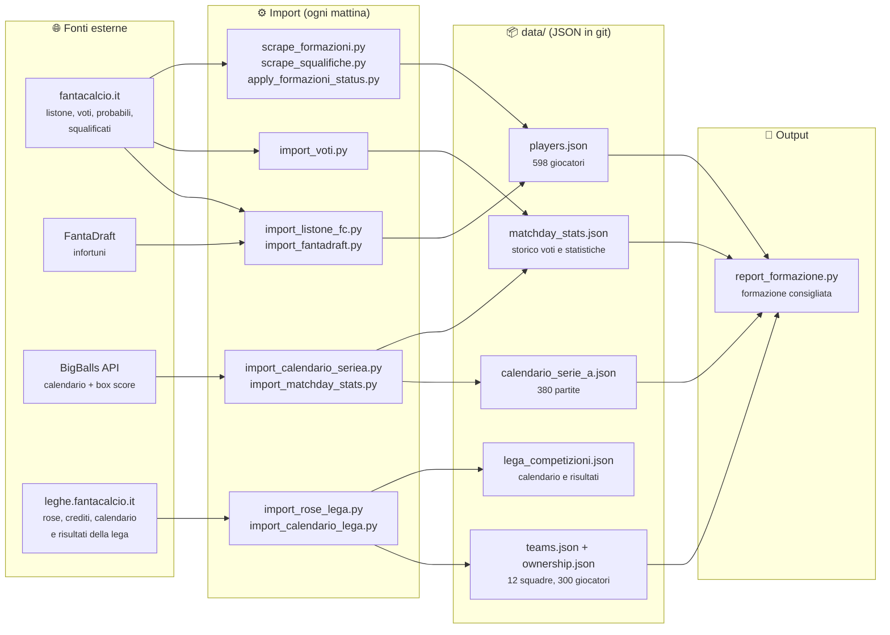

<h1 align="center">🍝 Fanta Carbonara</h1>

<p align="center">
  <em>Assistente dati per una lega di fantacalcio Classic: rose, voti, calendario della lega e consigli di formazione.<br>
  Costruito per essere pilotato a voce insieme a Claude Code.</em>
</p>

<p align="center">
  
  
  
  
</p>

---

## Cos'è (e cosa non è)

Una lega da 12 squadre su [leghe.fantacalcio.it](https://leghe.fantacalcio.it), modalità
Classic, 500 crediti, rose 3P-8D-8C-6A. Questo repo tiene **i dati** di quella lega e
li usa per rispondere a due domande: *chi schiero questa giornata* e *quanto vale
questo scambio*.

L'asta di inizio stagione è **conclusa** (settembre 2026). Da lì in poi la fonte delle
rose è la lega vera: il repo le rilegge ogni mattina da leghe.fantacalcio.it, insieme a
crediti, calendario testa-a-testa e risultati, invece di trascriverle a mano.

La regola che tiene in piedi tutto il progetto è una sola:

> **Un dato che manca resta mancante.** Mai un voto stimato, mai uno status dedotto,
> mai una giornata indovinata. Se una fonte non ce l'ha, lo script lo dice e si ferma.

E la sua gemella: **lo storico non si accorcia mai.** Un voto o un risultato già salvato
non sparisce perché la fonte non lo mostra più o perché il giocatore è stato venduto
all'estero: lo script che ci proverebbe si rifiuta di scrivere.

Sembra pedante finché non scopri che la tua fonte di statistiche mette un giocatore
del Liverpool nel tabellino di Roma-Inter (→ [`.docs/bigballs-api.md`](.docs/bigballs-api.md)).

## Come si muovono i dati


```mermaid
flowchart LR
    subgraph fonti["🌐 Fonti esterne"]
        FC["fantacalcio.it<br/><small>listone, voti, probabili,<br/>squalificati</small>"]
        FD["FantaDraft<br/><small>infortuni</small>"]
        BB["BigBalls API<br/><small>calendario + box score</small>"]
        LF["leghe.fantacalcio.it<br/><small>rose, crediti, calendario<br/>e risultati della lega</small>"]
    end

    subgraph scripts["⚙️ Import (ogni mattina)"]
        I1["import_listone_fc.py<br/>import_fantadraft.py"]
        I2["import_voti.py"]
        I3["import_calendario_seriea.py<br/>import_matchday_stats.py"]
        I4["scrape_formazioni.py<br/>scrape_squalifiche.py<br/>apply_formazioni_status.py"]
        I5["import_rose_lega.py<br/>import_calendario_lega.py"]
    end

    subgraph dati["📦 data/ (JSON in git)"]
        P["players.json<br/><small>598 giocatori</small>"]
        M["matchday_stats.json<br/><small>storico voti e statistiche</small>"]
        C["calendario_serie_a.json<br/><small>380 partite</small>"]
        O["teams.json + ownership.json<br/><small>12 squadre, 300 giocatori</small>"]
        L["lega_competizioni.json<br/><small>calendario e risultati</small>"]
    end

    subgraph out["🎯 Output"]
        R["report_formazione.py<br/><small>formazione consigliata</small>"]
    end

    FC --> I1 --> P
    FD --> I1
    FC --> I2 --> M
    FC --> I4 --> P
    BB --> I3 --> C & M
    LF --> I5 --> O & L
    P & O & M & C --> R
```

## Quickstart

```bash
pip install -r requirements.txt
export BIGBALLS_API_KEY=... LEGHE_FC_USERNAME=... LEGHE_FC_PASSWORD=...

# Il giro completo, nell'ordine giusto, è la skill aggiorna-dati. A mano:
python3 scripts/import_listone_fc.py                       # listone (fantacalcio.it)
python3 scripts/import_fantadraft.py                       # infortuni
python3 scripts/import_rose_lega.py --league-id 923348     # rose e crediti della lega
python3 scripts/import_calendario_lega.py --league-id 923348
python3 scripts/import_calendario_seriea.py --season 2026 --status finished
python3 scripts/import_matchday_stats.py                   # box score (BigBalls)
python3 scripts/import_voti.py                             # voti Redazione (fantacalcio.it)
python3 scripts/scrape_formazioni.py && python3 scripts/scrape_squalifiche.py
python3 scripts/apply_formazioni_status.py

# La formazione della mia squadra
python3 scripts/report_formazione.py --team-id 20598917 --matchday 6
```

Nella pratica non serve lanciarli: una **routine gira ogni giorno alle 6:52** (ora
italiana), esegue la skill `aggiorna-dati` e pusha i dati su `main`.

## In azione

**La formazione consigliata** per la giornata 6, calcolata sui voti delle giornate 1-5:

```console
$ python3 scripts/report_formazione.py --team-id 20598917 --matchday 6
Giornata 6 — modalità classic, cambi illimitati nello stesso ruolo
Prossimo turno dal calendario: 10/10 - 12/10 (10 partite)
Scadenza formazione: 10/10 alle 15:00 (ora italiana), inizio di Genoa-Fiorentina
Modulo consigliato: 4-3-3

TITOLARI:
  [P] Martinez Jo.            4.51  media 4.40 su 5 voti        titolare 90%      vs Parma (C) 10/10
  [D] Kamara H.               6.89  media 7.40 su 5 voti        titolare 90%      vs Torino (T) 12/10
  [D] Doekhi                  6.36  media 6.67 su 3 voti        ballottaggio 50%  vs Monza (C) 11/10   <- se non gioca entra Valeri
  ...
  [C] Frattesi                7.70  media 8.50 su 5 voti        titolare 90%      vs Monza (C) 11/10
  ...
  [A] Esposito Se.            7.30  media 8.00 su 2 voti        ballottaggio 70%  vs Milan (C) 11/10   <- se non gioca entra Adams A.
```

Il numero a sinistra è quello usato per scegliere: la media fantavoto quando il giocatore
gioca, avvicinata alla media del ruolo se i voti sono pochi (Esposito, 2 voti, passa da
8,00 a 7,30).

**Cosa abilita lo storico dei box score** — esempio dalle giornate 1-5:

```
TOP GOL                                        TOP CARTELLINI GIALLI
Malen        Roma       6 gol in 347'          Ostigard   Genoa      3 gialli, 6 falli
Raimondo     Frosinone  4 gol in 329'          Akanji     Inter      2 gialli, 4 falli
Varela G.    Monza      4 gol in 341'          Hermoso    Roma       2 gialli, 3 falli
```

Non è una classifica da esibire: i cartellini e i falli dicono chi rischia nelle partite
toste. Per le squalifiche vere il repo non conta i gialli da sé, legge la fonte
ufficiale: squalificati e diffidati arrivano dalla pagina "Indisponibili" di
fantacalcio.it, e il report esclude i primi e ti avvisa dei secondi.

## Struttura dei dati

Tutto in `data/`, JSON versionati in git — niente database, niente stato nascosto.

| File | Contenuto | Stato (27/09) |
|---|---|---|
| `players.json` | Listone ufficiale fantacalcio.it: ruolo, squadra, quotazione iniziale e attuale, FVM, status | 598 giocatori |
| `matchday_stats.json` | Per giocatore/partita: voto e fantavoto (Redazione), gol, assist, cartellini, falli, minuti, avversario, casa/trasferta. **Non si accorcia mai** | 2068 righe, 1443 fantavoti (giornate 1-5) |
| `calendario_serie_a.json` | Calendario e risultati Serie A | 380 partite (50 giocate) |
| `teams.json` | Le squadre in gioco della lega, crediti totali e rimanenti | 12 squadre |
| `ownership.json` | Chi possiede chi, a che prezzo, con che modalità | 300 giocatori |
| `lega_competizioni.json` | Competizioni della lega, calendario testa-a-testa e risultati. **Una giornata calcolata non si perde mai** | campionato FANTACARBONARA, 33 giornate |
| `injuries.json` | Infortuni in corso con rientro previsto | 48 voci |
| `squalifiche.json` | Squalificati e diffidati attuali | aggiornato ogni giro |
| `formazioni_history.json` | Storico delle probabili formazioni pubblicate | accumulo continuo |
| `market_log.json` | Log di acquisti, scambi e svincoli registrati con `asta.py` | usato solo per simulare |

`config/league.json` tiene moduli ammessi, requisiti di rosa, la mia squadra
(`my_team_id`: VAR-tificiale), l'id della lega, la fonte dei voti (`fonte_voti`:
Redazione Fantacalcio) e le regole della lega prese dal regolamento FantaCarbonara,
ognuna con la sua fonte:

- **`regole_lega`**: niente modificatore di difesa, cambi illimitati nello stesso ruolo,
  rinvii (vedi sotto), scadenza della formazione, penalità per formazione non schierata.
- **`regole_mercato`**: ogni offerta deve lasciare almeno 1 credito per ogni slot ancora
  vuoto, pena la perdita del giocatore e di tutti i successivi; svincolo rimborsato 1
  credito, cessione all'estero o in Serie B rimborsata al prezzo d'acquisto; asta di
  riparazione con +50 crediti; scambi solo a gennaio. `asta.py` non le applica ancora.
- **`competizioni`**: criteri di parità di campionato, Champions, Europa e Coppa Italia,
  per la futura classifica.
- **`scoring`**: solo a titolo informativo, il fantavoto arriva già calcolato dal sito.
  Due valori restano `null` perché il regolamento non li chiarisce ("Rigore +2", porta
  inviolata).

## Come ragiona il consiglio di formazione

`report_formazione.py` ordina i giocatori di ogni ruolo per il fantavoto atteso **se
prendono voto**, perché con i cambi illimitati chi non scende in campo viene coperto dal
primo della panchina. La probabilità di giocare non entra nell'ordine, ma negli avvisi
("se non gioca entra X").

Il valore ha tre pezzi, mostrati in colonna e spiegati in una riga per titolari e primi
cambi, e ognuno è entrato solo perché migliora le previsioni nel backtest
(`backtest_formazione.py`: ogni giornata prevista con i dati delle precedenti):

- **voti**: media degli ultimi 5 fantavoti, avvicinata alla media del ruolo come se il
  giocatore avesse 5 partite in più;
- **prod**: nei voti, i gol su azione sostituiti da quelli attesi dai tiri in porta;
- **avv**: quanto subisce l'avversario della prossima partita.

Sulle giornate 3-5 il nuovo valore indovina chi fa di più tra due giocatori della stessa
rosa nel 59% dei casi, contro il 53,5% di prima: meglio, ma lontano dalla certezza. Per
questo la sezione **DECISIONI TUE** elenca le scelte entro 0,20 punti, dove il modello
non sa fare meglio di una moneta.

Le partite rinviate seguono la regola della lega, che vale **per giornata**:

| Partite rinviate nella giornata | Cosa prendono i giocatori | Come li tratta il report |
|---|---|---|
| da 1 a 3 | 6 politico, senza recupero | valgono 6 nell'ordine (6 sicuro, niente cambio) |
| più di 3 | il voto del recupero, per tutte | restano con la loro media |

Una partita spostata ma giocata dentro la giornata non è un rinvio. Con esattamente 3
rinvii il report avvisa che uno in più, anche dopo la scadenza, cambia la regola per
tutti. Stampa anche la **scadenza della formazione**: l'inizio della prima partita non
rinviata del turno. Se il turno non si ricostruisce dalle date del calendario, non
applica niente di tutto questo e chiede di controllare a mano. Revisione completa della
logica: [`.docs/difetti-consiglio-formazione.md`](.docs/difetti-consiglio-formazione.md).

## Fonti dei dati, con i loro difetti

Nessuna fonte è trattata come oro colato. Quello che sappiamo è documentato, non scoperto
due volte:

| Fonte | Cosa ci prendiamo | Cosa sappiamo che non funziona |
|---|---|---|
| **fantacalcio.it** (HTML pubblico) | Listone ufficiale (598, stessi id dell'asta), voti Redazione, probabili formazioni, squalificati e diffidati | Voti e listone abbinati per id; probabili e squalificati per nome, quindi i "non trovati" vanno guardati. "55" nei voti vuol dire senza voto |
| **FantaDraft** (GitHub, pubblico) | Infortuni | Ha solo 532 giocatori su 598: per questo il listone non viene più da qui |
| **BigBalls API** | Calendario, risultati, box score per giocatore (anche tiri, passaggi chiave, subentrato) | Squadra sbagliata per chi ha cambiato maglia (recuperati riconciliando coi voti), giocatori estranei, eventi duplicati, `round` in ritardo di un giorno, rigori quasi assenti; 17 giocatori con voto che non ha proprio |
| **leghe.fantacalcio.it** (API privata) | Rose, crediti, competizioni, calendario e risultati della lega | Non documentata, due JWT di cui uno inutile, solo lettura. Mostra anche 6 squadre vuote; mentre l'admin sposta una rosa può restituire per qualche secondo quasi tutte le rose vuote. Nessun endpoint per la classifica |

Dettagli, endpoint e trappole verificate: [`.docs/bigballs-api.md`](.docs/bigballs-api.md) e
[`.docs/leghe-fc-api.md`](.docs/leghe-fc-api.md).

## Stato e prossimi passi

- [x] Listone ufficiale completo e infortuni
- [x] Modulo asta (l'asta è conclusa; resta utile per simulare)
- [x] Probabili formazioni con storico, squalificati e diffidati
- [x] Calendario Serie A completo della stagione
- [x] Storico per giocatore: gol, assist, cartellini, falli, minuti
- [x] **Voti e fantavoto** (Redazione Fantacalcio) dalla giornata 1, con storico che non si accorcia
- [x] **Rose e crediti reali** delle 12 squadre, da leghe.fantacalcio.it
- [x] **Calendario testa-a-testa e risultati della lega**
- [x] Regolamento della lega in config; rinvii e scadenza nel report formazione
- [x] Routine quotidiana di aggiornamento dati
- [ ] **Classifica della lega** — non c'è un endpoint: si ricaverà dal calendario, alla prima giornata calcolata (Serie A 6, 10-12/10)
- [ ] **Voti calcolati dalla lega** (`teamLineup`) — da verificare alla prima giornata calcolata
- [ ] **Regole di mercato in `asta.py`** (sforamento, rimborsi) — per l'asta di riparazione
- [x] **Formazione consigliata che pesa avversario e produzione offensiva**, verificata con backtest; casa/trasferta provata e scartata

## Skill per Claude Code

Il repo è pensato per essere usato conversando. In `.claude/skills/`:

| Skill | Quando parte |
|---|---|
| `aggiorna-dati` | la routine del mattino / «aggiorna tutti i dati» |
| `asta` | «preso Lautaro dal Barattolo FC per 112» (oggi solo per simulare) |
| `aggiorna-formazioni` | «aggiorna le probabili» / prima di ogni deadline |
| `formazione` | «che formazione schiero?» |

## Credenziali

Solo da variabili d'ambiente, mai nei file, mai in chat:
`LEGHE_FC_USERNAME`, `LEGHE_FC_PASSWORD`, `BIGBALLS_API_KEY`.
Una chiave incollata in chat va considerata compromessa e rigenerata.
