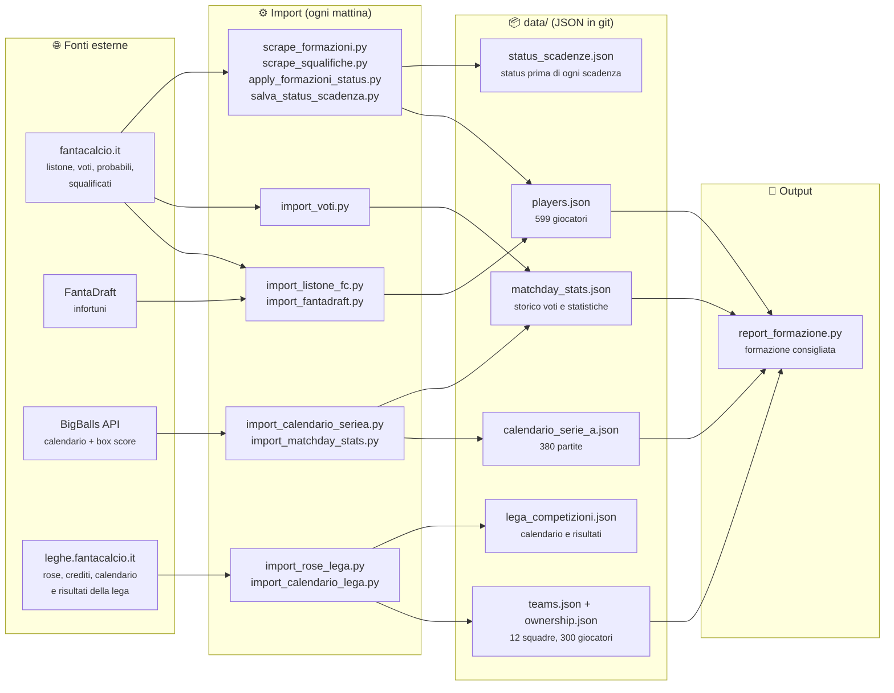

<h1 align="center">🍝 Fanta Carbonara</h1>

<p align="center">
  <em>Assistente dati per una lega di fantacalcio Classic: rose, voti, calendario della lega e consigli di formazione.<br>
  Costruito per essere pilotato a voce insieme a Claude Code.</em>
</p>

<p align="center">
  
  
  
  
</p>

---

## Cos'è (e cosa non è)

Una lega da 12 squadre su [leghe.fantacalcio.it](https://leghe.fantacalcio.it), modalità
Classic, 500 crediti, rose 3P-8D-8C-6A. Questo repo tiene **i dati** di quella lega e
li usa per rispondere a due domande: *chi schiero questa giornata* e *quanto vale
questo scambio*.

L'asta di inizio stagione è **conclusa** (settembre 2026). Da lì in poi la fonte delle
rose è la lega vera: il repo le rilegge ogni mattina da leghe.fantacalcio.it, insieme a
crediti, calendario testa-a-testa e risultati, invece di trascriverle a mano.

La regola che tiene in piedi tutto il progetto è una sola:

> **Un dato che manca resta mancante.** Mai un voto stimato, mai uno status dedotto,
> mai una giornata indovinata. Se una fonte non ce l'ha, lo script lo dice e si ferma.

E la sua gemella: **lo storico non si accorcia mai.** Un voto o un risultato già salvato
non sparisce perché la fonte non lo mostra più o perché il giocatore è stato venduto
all'estero: lo script che ci proverebbe si rifiuta di scrivere.

Sembra pedante finché non scopri che la tua fonte di statistiche mette un giocatore
del Liverpool nel tabellino di Roma-Inter (→ [`.docs/bigballs-api.md`](.docs/bigballs-api.md)).

## Come si muovono i dati


```mermaid
flowchart LR
    subgraph fonti["🌐 Fonti esterne"]
        FC["fantacalcio.it<br/><small>listone, voti, probabili,<br/>squalificati</small>"]
        FD["FantaDraft<br/><small>infortuni</small>"]
        BB["BigBalls API<br/><small>calendario + box score</small>"]
        LF["leghe.fantacalcio.it<br/><small>rose, crediti, calendario<br/>e risultati della lega</small>"]
    end

    subgraph scripts["⚙️ Import (ogni mattina)"]
        I1["import_listone_fc.py<br/>import_fantadraft.py"]
        I2["import_voti.py"]
        I3["import_calendario_seriea.py<br/>import_matchday_stats.py"]
        I4["scrape_formazioni.py<br/>scrape_squalifiche.py<br/>apply_formazioni_status.py<br/>salva_status_scadenza.py"]
        I5["import_rose_lega.py<br/>import_calendario_lega.py"]
    end

    subgraph dati["📦 data/ (JSON in git)"]
        P["players.json<br/><small>599 giocatori</small>"]
        S["status_scadenze.json<br/><small>status prima di ogni scadenza</small>"]
        M["matchday_stats.json<br/><small>storico voti e statistiche</small>"]
        C["calendario_serie_a.json<br/><small>380 partite</small>"]
        O["teams.json + ownership.json<br/><small>12 squadre, 300 giocatori</small>"]
        L["lega_competizioni.json<br/><small>calendario e risultati</small>"]
    end

    subgraph out["🎯 Output"]
        R["report_formazione.py<br/><small>formazione consigliata</small>"]
    end

    FC --> I1 --> P
    FD --> I1
    FC --> I2 --> M
    FC --> I4 --> P & S
    BB --> I3 --> C & M
    LF --> I5 --> O & L
    P & O & M & C --> R
```

## Quickstart

```bash
pip install -r requirements.txt
export BIGBALLS_API_KEY=... LEGHE_FC_USERNAME=... LEGHE_FC_PASSWORD=...

# Il giro completo, nell'ordine giusto, è la skill aggiorna-dati. A mano:
python3 scripts/import_listone_fc.py                       # listone (fantacalcio.it)
python3 scripts/import_fantadraft.py                       # infortuni
python3 scripts/import_rose_lega.py --league-id 923348     # rose e crediti della lega
python3 scripts/import_calendario_lega.py --league-id 923348
python3 scripts/import_calendario_seriea.py --season 2026 --status finished
python3 scripts/import_matchday_stats.py                   # box score (BigBalls)
python3 scripts/import_voti.py                             # voti Redazione (fantacalcio.it)
python3 scripts/scrape_formazioni.py && python3 scripts/scrape_squalifiche.py
python3 scripts/apply_formazioni_status.py
python3 scripts/salva_status_scadenza.py                   # foto degli status prima della scadenza
python3 scripts/import_storico_stagioni.py --stagioni 2026-27 --corrente  # rigori di quest'anno
python3 scripts/rigoristi.py calcola                       # consenso sulle gerarchie dei rigoristi

# La formazione della mia squadra
python3 scripts/report_formazione.py --team-id 20598917 --matchday 6
```

Nella pratica non serve lanciarli: una **routine gira ogni giorno alle 6:52** (ora
italiana), esegue la skill `aggiorna-dati` e pusha i dati su `main`.

## In azione

**La formazione consigliata** per la giornata 6, calcolata il 29/09 sui voti delle giornate
1-5 (i dati si aggiornano ogni mattina, quindi rilanciandolo i numeri si spostano):

```console
$ python3 scripts/report_formazione.py --team-id 20598917 --matchday 6
Giornata 6 — modalità classic, panchina di 7 (1 P, 2 D, 2 C, 2 A), cambi solo tra pari ruolo
Prossimo turno dal calendario: 10/10 - 12/10 (10 partite)
Scadenza formazione: 10/10 alle 15:00 (ora italiana), inizio di Genoa-Fiorentina
Modulo consigliato: 3-4-3
...

TITOLARI:
  [P] Martinez Jo.        4.54  voti 4.55  avv -0.01                  titolare 90%      vs Parma (C) 10/10
  [D] Kamara H.           6.77  voti 6.72  avv +0.04                  titolare 90%      vs Torino (T) 12/10
  [D] Doekhi              6.55  voti 6.28  avv +0.28                  ballottaggio 50%  vs Monza (C) 11/10   <- se non gioca entra Valeri
  ...
  [C] Frattesi            7.71  voti 7.43  avv +0.28                  titolare 90%      vs Monza (C) 11/10
  [C] Zaccagni            7.06  voti 6.78  avv +0.28             RIG! titolare 90%      vs Monza (C) 11/10
  ...
  [A] Esposito Se.        6.97  voti 7.16  avv -0.19                  ballottaggio 70%  vs Milan (C) 11/10   <- se non gioca entra Adams A.
  ...

PANCHINA — 7 di 7 posti (per ogni titolare senza voto entra il primo del suo ruolo;
se le riserve di quel ruolo finiscono, lo slot vale 0):
  P1  Provedel             -    senza voti                            panchina 5%       vs Parma (C) 10/10
  D1  Valeri              6.17  voti 6.12  avv +0.04                  titolare 90%      vs Inter (T) 10/10
  D2  Calvani             6.10  voti 6.17  avv -0.07                  titolare 90%      vs Napoli (T) 10/10
  C1  Ndour               6.29  voti 6.13  avv +0.16                  titolare 90%      vs Genoa (T) 10/10
  C2  Thorstvedt          5.89  voti 6.08  avv -0.19                  ballottaggio 85%  vs Milan (C) 11/10
  A1  Adams A.            6.50  voti 6.51  avv -0.01                  titolare 90%      vs Atalanta (T) 12/10
  A2  Simeone             6.43  voti 6.21  avv +0.22                  titolare 90%      vs Udinese (C) 12/10

FUORI DISTINTA (la panchina ha pochi posti per ruolo: questi non entrano):
  ...
  [C] Pierotti            5.96  voti 6.03  avv -0.07    ballottaggio 80%  vs Bologna (C) 11/10
  ...

PUNTEGGIO ATTESO: 71.1 punti (somma degli 11 slot, già scontata per
chi rischia di non prendere voto e per gli slot che possono restare vuoti).
  ...
  Soglie della lega: primo gol a 66, poi uno ogni 5.
  Il punteggio vero si allontana da quello atteso di circa 5.3 punti (una deviazione
  standard: 1.60 a giocatore, misurata su 786 voti delle giornate 3-5
  confrontando la previsione fatta prima con il voto vero). Quindi i gol sono probabilità:
    0 gol 17%   1 gol 32%   2 gol 33%   3 o più 18%
  ...
```

Il numero dopo il nome è il **fantavoto atteso se il giocatore prende voto**, e decide
l'ordine dentro ogni ruolo. È la somma delle due colonne che lo seguono (a meno di
arrotondamenti):

- **`voti`** è la media degli ultimi 5 fantavoti, avvicinata alla media del ruolo come se
  il giocatore avesse 5 partite in più da giocatore medio: Frattesi ha 8,50 su 5 voti e
  scende a 7,43; Esposito ha 8,00 ma su 2 voti soli, quindi scende di più, a 7,16.
- **`avv`** è quanto l'avversario della prossima partita subisce più o meno gol della media
  del campionato: il Monza ne prende 1,9 a partita e vale +0,28 a chi ci gioca contro
  (Frattesi, Zaccagni, Doekhi), il Milan 1,1 e toglie 0,19 a Esposito, che finisce a 6,97.

A destra c'è lo status dalle probabili formazioni di fantacalcio.it, con la percentuale di
titolarità. **Non entra nel numero**: se un titolare non prende voto entra il primo della
panchina del suo ruolo, quindi davanti va sempre il più forte (e l'avviso dice chi entra).
Entra invece nella scelta della panchina, che ha 7 posti fissi: se le riserve di un ruolo
finiscono lo slot vale 0, e una riserva che non gioca mai è un posto buttato. Per questo in
panchina c'è Thorstvedt (5,89, ballottaggio 85%) e non Pierotti (5,96, 80%). `RIG!` segna
chi ha già calciato un rigore quest'anno da primo rigorista delle fonti; serve da
spareggio, non entra nel numero.

**PUNTEGGIO ATTESO** traduce gli 11 slot in gol della lega (66 punti = 1 gol, 71 = 2, 76
= 3). 71,1 non vuol dire "2 gol": il punteggio vero di una formazione si è allontanato da
quello atteso di circa 7 punti, rigiocando le giornate 3-5 per tutte le rose della lega,
quindi il report dà uno scenario approssimativo per ogni risultato (il centro non è
ancora tarato). Per lo stesso motivo stare un soffio sopra una soglia non conta: un punto
atteso in più vale circa 0,17 gol ovunque, e le scelte si pesano in punti.

**Cosa abilita lo storico dei box score** — esempio dalle giornate 1-5:

```
TOP GOL                                        TOP CARTELLINI GIALLI
Malen        Roma       6 gol in 347'          Ostigard   Genoa      3 gialli, 6 falli
Raimondo     Frosinone  4 gol in 329'          Akanji     Inter      2 gialli, 4 falli
Varela G.    Monza      4 gol in 341'          Hermoso    Roma       2 gialli, 3 falli
```

Non è una classifica da esibire: i cartellini e i falli dicono chi rischia nelle partite
toste. Per le squalifiche vere il repo non conta i gialli da sé, legge la fonte
ufficiale: squalificati e diffidati arrivano dalla pagina "Indisponibili" di
fantacalcio.it, e il report esclude i primi e ti avvisa dei secondi.

## Struttura dei dati

Tutto in `data/`, JSON versionati in git — niente database, niente stato nascosto.

| File | Contenuto | Stato (29/09) |
|---|---|---|
| `players.json` | Listone ufficiale fantacalcio.it: ruolo, squadra, quotazione iniziale e attuale, FVM, status | 599 giocatori |
| `matchday_stats.json` | Per giocatore/partita: voto e fantavoto (Redazione), gol, assist, cartellini, falli, minuti, avversario, casa/trasferta. **Non si accorcia mai** | 2099 righe, 1443 fantavoti (giornate 1-5) |
| `calendario_serie_a.json` | Calendario e risultati Serie A | 380 partite (50 giocate) |
| `teams.json` | Le squadre in gioco della lega, crediti totali e rimanenti | 12 squadre |
| `ownership.json` | Chi possiede chi, a che prezzo, con che modalità | 300 giocatori |
| `lega_competizioni.json` | Competizioni della lega, calendario testa-a-testa e risultati. **Una giornata calcolata non si perde mai** | campionato FANTACARBONARA, 33 giornate |
| `injuries.json` | Infortuni in corso con rientro previsto | 50 voci |
| `squalifiche.json` | Squalificati e diffidati attuali | aggiornato ogni giro |
| `formazioni_history.json` | Storico delle probabili formazioni pubblicate | accumulo continuo |
| `status_scadenze.json` | Status e probabilità di titolarità di tutti i giocatori com'erano **prima della scadenza** di ogni turno (`salva_status_scadenza.py`): il backtest sa chi era fuori senza guardare il futuro | 1 turno (giornata 6), 599 giocatori |
| `storico_stagioni.json` | Le stagioni passate in Serie A di tutti i giocatori, solo come contesto, e a parte la stagione in corso, per i rigori ufficiali di quest'anno | 2025-26 (663), 2024-25 (679) |
| `rigoristi.json` | Gerarchie dei rigoristi secondo più fonti, col consenso calcolato da `rigoristi.py`. **Non è un dato ufficiale**: serve solo da spareggio | 20 squadre, 3 fonti |
| `notizie_rosa.json` | Fatti recenti sulle squadre dei miei giocatori, con le fonti e se sono verificati | 19 notizie, 17 verificate |
| `market_log.json` | Log di acquisti, scambi e svincoli registrati con `asta.py` | usato solo per simulare |

`config/league.json` tiene moduli ammessi, requisiti di rosa, la mia squadra
(`my_team_id`: VAR-tificiale), l'id della lega, la fonte dei voti (`fonte_voti`:
Redazione Fantacalcio) e le regole della lega prese dal regolamento FantaCarbonara,
ognuna con la sua fonte:

- **`regole_lega`**: niente modificatore di difesa; panchina di 7 posti a composizione
  fissa (1 P, 2 D, 2 C, 2 A), cambi solo tra pari ruolo e slot scoperto che vale 0; soglie
  gol (primo gol a 66, poi uno ogni 5); rinvii (vedi sotto), scadenza della formazione,
  penalità per formazione non schierata.
- **`regole_mercato`**: ogni offerta deve lasciare almeno 1 credito per ogni slot ancora
  vuoto, pena la perdita del giocatore e di tutti i successivi; svincolo rimborsato 1
  credito, cessione all'estero o in Serie B rimborsata al prezzo d'acquisto; asta di
  riparazione con +50 crediti; scambi solo a gennaio. `asta.py` non le applica ancora.
- **`competizioni`**: criteri di parità di campionato, Champions, Europa e Coppa Italia,
  per la futura classifica.
- **`scoring`**: solo a titolo informativo, il fantavoto arriva già calcolato dal sito.
  Due valori restano `null` perché il regolamento non li chiarisce ("Rigore +2", porta
  inviolata).

## Come ragiona il consiglio di formazione

`report_formazione.py` ordina i giocatori di ogni ruolo per il fantavoto atteso **se
prendono voto**: se un titolare non scende in campo entra il primo della panchina del suo
ruolo, quindi davanti va sempre il più forte. La probabilità di giocare non entra
nell'ordine ma negli avvisi ("se non gioca entra X") e nella scelta di **chi va in
panchina**: i posti sono 7 a quota fissa per ruolo e uno slot scoperto vale 0, quindi una
riserva che non gioca mai è un posto buttato.

Il valore ha due pezzi, mostrati in colonna e spiegati in una riga per titolari e primi
cambi:

- **voti**: media degli ultimi 5 fantavoti, avvicinata alla media del ruolo come se il
  giocatore avesse 5 partite in più;
- **avv**: quanto subisce l'avversario della prossima partita rispetto alla media.

Il collaudo è `backtest_undici.py`: per ogni giornata dalla 3 in poi schiera tutte le 12
rose della lega con i soli dati precedenti, applica le regole della panchina e somma i
punti **veri**. Al 29/09 il modello vale +2,61 punti a giornata rispetto all'ordine
d'acquisto (intervallo +0,64 / +4,56), +1,15 contro la semplice media dei voti, +0,56
scegliendo la panchina con la probabilità, +0,85 col termine avversario. Con 36
formazioni gli intervalli sono ottimisti e le etichette "dimostrato / non dimostrato"
cambiano per pochi centesimi: sono indizi, non verdetti. Il termine avversario resta ed è
provvisorio: si rimisura alla giornata 8. La correzione per la produzione offensiva (gol
attesi dai tiri in porta) è spenta dal 27/09 perché non ha mostrato guadagni; l'a priori
da quotazione e stagione scorsa, casa/trasferta e la scelta del modulo col valore atteso
sono stati provati e lasciati fuori. La regola è a favore dello stato attuale, e
dichiarata: nessun cambiamento, né per aggiungere un pezzo né per toglierlo, senza un
intervallo che escluda lo zero. Numeri e ragionamenti in
[`.docs/analisi-valutazione-formazione.md`](.docs/analisi-valutazione-formazione.md).

Resta lontano dalla certezza: con distacchi sotto 0,20 punti l'ordine previsto indovina
chi fa di più quasi come una moneta. Per questo la sezione **DECISIONI TUE** elenca quelle
scelte e le lascia a te.

Le partite rinviate seguono la regola della lega, che vale **per giornata**:

| Partite rinviate nella giornata | Cosa prendono i giocatori | Come li tratta il report |
|---|---|---|
| da 1 a 3 | 6 politico, senza recupero | valgono 6 nell'ordine (6 sicuro, niente cambio) |
| più di 3 | il voto del recupero, per tutte | restano con la loro media |

Una partita spostata ma giocata dentro la giornata non è un rinvio. Con esattamente 3
rinvii il report avvisa che uno in più, anche dopo la scadenza, cambia la regola per
tutti. Stampa anche la **scadenza della formazione**: l'inizio della prima partita non
rinviata del turno. Se il turno non si ricostruisce dalle date del calendario, non
applica niente di tutto questo e chiede di controllare a mano. Revisione completa della
logica: [`.docs/difetti-consiglio-formazione.md`](.docs/difetti-consiglio-formazione.md).

## Fonti dei dati, con i loro difetti

Nessuna fonte è trattata come oro colato. Quello che sappiamo è documentato, non scoperto
due volte:

| Fonte | Cosa ci prendiamo | Cosa sappiamo che non funziona |
|---|---|---|
| **fantacalcio.it** (HTML pubblico) | Listone ufficiale (598, stessi id dell'asta), voti Redazione, probabili formazioni, squalificati e diffidati | Voti e listone abbinati per id; probabili e squalificati per nome, quindi i "non trovati" vanno guardati. "55" nei voti vuol dire senza voto |
| **FantaDraft** (GitHub, pubblico) | Infortuni | Ha solo 532 giocatori su 598: per questo il listone non viene più da qui |
| **BigBalls API** | Calendario, risultati, box score per giocatore (anche tiri, passaggi chiave, subentrato) | Squadra sbagliata per chi ha cambiato maglia (recuperati riconciliando coi voti), giocatori estranei, eventi duplicati, `round` in ritardo di un giorno, rigori quasi assenti; 17 giocatori con voto che non ha proprio |
| **leghe.fantacalcio.it** (API privata) | Rose, crediti, competizioni, calendario e risultati della lega | Non documentata, due JWT di cui uno inutile, solo lettura. Mostra anche 6 squadre vuote; mentre l'admin sposta una rosa può restituire per qualche secondo quasi tutte le rose vuote. Nessun endpoint per la classifica |

Dettagli, endpoint e trappole verificate: [`.docs/bigballs-api.md`](.docs/bigballs-api.md) e
[`.docs/leghe-fc-api.md`](.docs/leghe-fc-api.md).

## Stato e prossimi passi

- [x] Listone ufficiale completo e infortuni
- [x] Modulo asta (l'asta è conclusa; resta utile per simulare)
- [x] Probabili formazioni con storico, squalificati e diffidati
- [x] Calendario Serie A completo della stagione
- [x] Storico per giocatore: gol, assist, cartellini, falli, minuti
- [x] **Voti e fantavoto** (Redazione Fantacalcio) dalla giornata 1, con storico che non si accorcia
- [x] **Rose e crediti reali** delle 12 squadre, da leghe.fantacalcio.it
- [x] **Calendario testa-a-testa e risultati della lega**
- [x] Regolamento della lega in config; rinvii e scadenza nel report formazione
- [x] Routine quotidiana di aggiornamento dati
- [ ] **Classifica della lega** — non c'è un endpoint: si ricaverà dal calendario, alla prima giornata calcolata (Serie A 6, 10-12/10)
- [ ] **Voti calcolati dalla lega** (`teamLineup`) — da verificare alla prima giornata calcolata
- [ ] **Regole di mercato in `asta.py`** (sforamento, rimborsi) — per l'asta di riparazione
- [x] **Formazione consigliata con la panchina vera della lega** (7 posti) e il punteggio atteso in gol, verificata col backtest in punti; produzione offensiva, casa/trasferta e modulo col valore atteso provati e scartati

## Skill per Claude Code

Il repo è pensato per essere usato conversando. In `.claude/skills/`:

| Skill | Quando parte |
|---|---|
| `aggiorna-dati` | la routine del mattino / «aggiorna tutti i dati» |
| `asta` | «preso Lautaro dal Barattolo FC per 112» (oggi solo per simulare) |
| `aggiorna-formazioni` | «aggiorna le probabili» / prima di ogni deadline |
| `formazione` | «che formazione schiero?» |

## Credenziali

Solo da variabili d'ambiente, mai nei file, mai in chat:
`LEGHE_FC_USERNAME`, `LEGHE_FC_PASSWORD`, `BIGBALLS_API_KEY`.
Una chiave incollata in chat va considerata compromessa e rigenerata.
